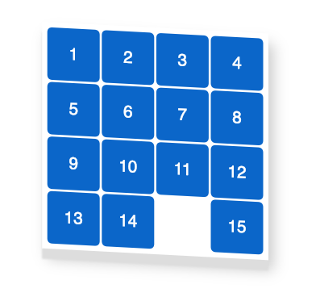

# 15 game

Idea of implementation is declarative approach to rerender UI whenever state is changed. Representation of state is  array 4x4 and renderer for the game is `renderGame` function. Whenever state is changed we will call `renderGame` with new state;

## State of game
State of the game will be represented by array of arrays
```
const fifteen = [
	[1, 2, 3, 4],
	[5, 6, 7, 8],
	[9, 10, 11, 12],
	[13, 14, null, 15]
];
```
Where every number is a cell of game and null is a an empty cell.

With the state above UI will look:



### getXY
`getXY` function which returns object with current position of an empty cell, as an argument it takes state of game (array of arrays)
```
const getXY = (source) => {
	const y = source.findIndex(arr => arr.includes(null));
	const x = source[y].findIndex(x => x === null);
	return { y, x };
};
const fifteen = [
	[1, 2, 3, 4],
	[5, 6, 7, 8],
	[9, 10, 11, 12],
	[13, 14, null, 15]
];
const xy = getXY(fifteen); // {y: 3, x: 2} it means current position of an empty cell - fifteen[3][2]
```

Game is finished when state is equal to:
```
[
	[1, 2, 3, 4],
	[5, 6, 7, 8],
	[9, 10, 11, 12],
	[13, 14, 15, null]
];
```
### shuffleState

`shuffleState` function which returns shuffled state, it takes as an argument state of the game. Use this function when you start new game;

```
const shuffleState = (state) => {
	const suffleArr = (inputArr) => {
		const arr = [...inputArr];
		for (var j, x, i = arr.length; i; j = parseInt(Math.random() * i), x = arr[--i], arr[i] = arr[j], arr[j] = x);
		return arr;
	}
	const flattenArr = state.reduce((acc, val) => {
		return [...acc, ...val]
	}, []);
	const shuffledArr = suffleArr(flattenArr);
	return [
		shuffledArr.slice(0,4),
		shuffledArr.slice(4,8),
		shuffledArr.slice(8,12),
		shuffledArr.slice(12,16),
	]
}
```

## Render UI
Use functions bellow to render UI for the game.
### renderRow
`renderRow` function which returns string that represents html content for one row, as an argument it takes an array of values. This function is going to be used in the function that will return html for all rows.
```
/*
example  of argument
const arr = [1, 2, 3, 4]
*/

const renderRow = (arr) =>
	`<div class='square'>${arr.join('</div><div class=\'square\'>')}</div>`
```
### renderRows
`renderRows` function which returns string that represents html content for all rows. As an argument it takes array of array of values.
```
/*
 example  of argument
 
 const arr = [
	[1, 2, 3, 4],
	[5, 6, 7, 8],
	...
 ]
*/

const renderRows = (arr) => {
	return arr.reduce((acc, current) => {
		return acc + renderRow(current);
	}, '');
};
```

### renderGame

`renderGame` function which renders into the dom UI for the game, it takes 2 arguments, first - array of arrays of values, second argument is a place (dom node) where game will be rendered, by default it is a div with 'app' id. When you use this function make sure you have this dom node in the html file.
```
const renderGame = (shuffledArray, domNode = document.getElementById('app')) => {
	const rows = renderRows(shuffledArray).replace(
		'<div class=\'square\'></div>',
		'<div class=\'square empty\'></div>'
	);
	domNode.innerHTML = rows;
};
```
When we have our UI is rendered we need to add styles so our html content looks like a game.

### Styles

Add `styles.css` file with the following styles:

```
body {
	font-family: sans-serif;
	}
  
#app {
	position: absolute;
	top: 50%;
	left: 50%;
	transform: scale(1.3) translate(-50%, -50%) skew(0deg, 3deg);
	padding: 4px;
	background: #fff;
	display: flex;
	width: 208px;
	height: 208px;
	flex-wrap: wrap;
	box-shadow: 0px 10px 1px #ddd, 5px 10px 20px #ccc;
}

.square {
	display: flex;
	color: #fff;
	flex-direction: column;
	justify-content: center;
	margin: 1px;
	align-items: center;
	width: 50px;
	height: 50px;
	border-radius: 5px;
	background-color: #06c;
}

.square.empty {
	background-color: #fff;
}
```
Import css file into your js file.
## Controls
Add to the document event listener for `keydown` event. You should react when one of the **arrows** button (use keycode to check if it's arrow button) is pressed. Idea is you should swap empty cell (null value in the state) with the neighbor cell depending on which arrow button is pressed and then rerender Game (use `renderGame` function).
For example, given that empty cell has position `{y: 3, x: 2}` and up arrow is pressed you should swap with cell that has posiiton `{y: 4, x: 2}` (let's say it is **11**)  so empty cell becomes `{y: 4, x: 2}` and **11** becomes `{y: 3, x: 2}`, when you did swap then rerender the game.
Code example:
```
document.addEventListener('keydown', e => {
		const xyOfEmptyCell = getXY(stateOfGame);
		if (e.keyCode === 38) {
			// up arrow
			if (xyOfEmptyCell.y === 3) return; // figure out why we have this checking
			const nextY = xyOfEmptyCell.y + 1;
			const nextX = xyOfEmptyCell.x;
			stateOfGame[xyOfEmptyCell.y][xyOfEmptyCell.x] = stateOfGame[nextY][nextX];
			stateOfGame[nextY][nextX] = null;
			renderGame(stateOfGame);
		}
});
```

## Winning state

Write function which checks if game is finished (user won), if user won - do alert with congratulation message, after user close alert new game is started automatically.

## Let's begin
```
...

const fifteen = [
  [1, 2, 3, 4],
  [5, 6, 7, 8],
  [9, 10, 11, 12],
  [13, 14, null, 15]
];

const state = shuffleState(fifteen);
renderGame(state);

document.addEventListener('keydown', (e) => {
	...
});

...
```

## Bonus
* Investigate implementation of functions in this tutorial.
* Use `eslint` for this project.
